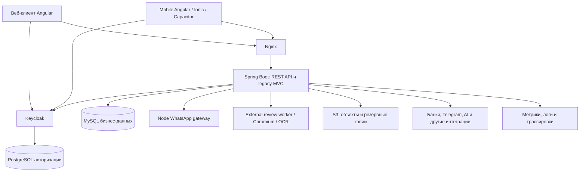

**Архитектурный аудит проекта otziv — 7 сентября 2026 года**

**Заключение**

У проекта профессиональная технологическая и эксплуатационная основа, но неоднородная архитектурная зрелость. Выбор Spring Boot, Angular, MySQL, Keycloak и отдельных интеграционных процессов обоснован. В проекте есть качественные механизмы безопасности, транзакционной целостности, миграций, тестирования и восстановления. При этом границы предметных областей слабо защищены, центральные сервисы и страницы чрезмерно разрослись, а гарантии доставки и конкурентного выполнения реализованы непоследовательно. Найдены воспроизводимые функциональные дефекты.

Точная характеристика: **крупный развиваемый монолит с предметной группировкой пакетов, отдельными интеграционными сервисами и существенным архитектурным долгом**. Называть его полностью изолированным модульным монолитом преждевременно. Основное направление развития — усиление границ и завершение механизмов надёжности внутри существующей системы. Необходимость перехода на микросервисы из изученного кода не следует.

**Основание и границы проверки**

- Проверены структура и зависимости основных частей, backend, web/mobile, legacy templates, схемы и миграции, фоновые интеграции, безопасность, Docker/Nginx, CI, резервирование, наблюдаемость и документация.
- Выполнены сквозная инвентаризация, статический анализ зависимостей и углублённое чтение критичных сценариев. Это не утверждение о построчной верификации каждой функции или полном доказательстве корректности всех бизнес-правил.
- База Git на старте: `3458e56f`; аудит учитывает незакоммиченные и новые рабочие файлы. Диагностические копии из `diagnostics` не считались актуальной реализацией.
- Во время аудита рабочие файлы продолжали изменяться извне. Метрики относятся к моменту инвентаризации; результаты клиентских тестов и сборок — к срезу примерно 03:36 UTC 07.09.2026. Последующие изменения требуют своей проверки.
- Production-сервер, реальные секреты, внешние настройки мониторинга, банковские операции и реальные данные пользователей не проверялись. Сервисы не разворачивались, сообщения не отправлялись.
- Исходный код и конфигурация в рамках аудита не исправлялись. Добавлен этот отчёт; локальные сборки сформировали обычные build artifacts.
- Полный Java suite недоступен из-за Java 25 вместо требуемой Java 26 и неработающего Docker daemon. Это ограничение окружения, а не установленная неисправность приложения.

**Что означает соответствие «мировым стандартам»**

Единой обязательной архитектуры для всех продуктов нет. Стандарты помогают задавать измеримые свойства и описывать решения. ISO/IEC 25010:2023 задаёт модель качества продукта; ISO/IEC/IEEE 42010:2022 относится к описанию архитектуры и прямо отделяет его от самой архитектуры. Поэтому число сервисов, названия папок или применение Clean Architecture сами по себе не подтверждают соответствие. Здесь использованы общедоступные описания стандартов; формальная оценка соответствия полному нормативному тексту не проводилась. [ISO 25010](https://www.iso.org/standard/78176.html), [ISO 42010](https://www.iso.org/standard/74393.html).

Для безопасности ориентир — проверяемые требования OWASP ASVS; для структуры Spring-приложения — явные API модулей и проверка допустимых зависимостей. Spring Modulith предоставляет проверку циклов, обращений к внутренним частям и разрешённых зависимостей, но применение именно этого инструмента необязательно. [OWASP ASVS](https://owasp.org/www-project-application-security-verification-standard/), [Spring Modulith verification](https://docs.spring.io/spring-modulith/reference/verification.html).

**Масштаб на момент инвентаризации**

| Область | Файлы | Строки, включая комментарии и пустые строки |
|---|---:|---:|
| Backend Java production | 1 735 | 295 842 |
| Backend Java test sources | 617 | 144 411 |
| Frontend TypeScript, включая specs | 270 | 78 820 |
| Mobile TypeScript | 113 | 61 997 |
| Flyway SQL | 373 | 21 772 |
| Legacy HTML templates | 115 | 15 655 |
| Документация в docs на старте | 25 | 3 533 |

Количество строк — индикатор размера, не показатель качества и не нормативный лимит. Особенно значимы сочетание размера, числа обязанностей и межмодульных зависимостей.

**Фактическое устройство**



Backend собирается одним Maven-приложением. Внутри есть группы orders/reviews, companies/users, payments/common_billing/contractor_payments, manager/worker workflows, leads, performers, AI, reporting и технические подсистемы. Отдельные HTTP-процессы обслуживают браузерную автоматизацию и WhatsApp. MySQL хранит бизнес-данные, PostgreSQL — данные Keycloak; это разные области восстановления.

Веб и мобильный клиент имеют отдельные приложения и интерфейсы. Backend параллельно поддерживает REST и Thymeleaf/MVC. Такое сосуществование допустимо при поэтапной миграции, но увеличивает число путей, в которых надо одинаково соблюдать права доступа и бизнес-инварианты.

| Измерение | Оценка | Основание |
|---|---|---|
| Выбор стека и крупных компонентов | Обоснован | Отдельная авторизация и браузерная обработка; монолит подходит тесно связанным бизнес-процессам |
| Границы backend-модулей | Требуют существенного улучшения | Большая связная группа пакетов, взаимные сервисные зависимости, нет автоматического контроля архитектурных правил |
| Целостность данных | Сильные решения в ключевых новых контурах, неоднородность в остальных | Flyway, validate, блокировки агрегатов, MySQL tests; недостаточные гарантии в performers и legacy sync |
| Клиентская архитектура | Современная основа, чрезмерная концентрация логики | Lazy standalone, strict typing, facades; многотысячные страницы и воспроизводимые async races |
| Безопасность | Значительный объём реализованной защиты, есть остаточные риски | Локальная проверка ролей, SSRF protection, изоляция; docker.sock, незавершённый отзыв JWT, dependency findings |
| Надёжность интеграций | Неоднородна | Durable recovery в ряде процессов; log-only failures, некорректные retry payload/queue и неоднозначные отправки |
| Тестирование и CI | Существенная база, неполная защита пользовательских сценариев | 905 выполненных JS/TS тестов прошли, но два клиентских дефекта воспроизводятся; full backend не запускался |
| Эксплуатация и восстановление | Развиты механизмы, полнота системы не доказана | Сильный MySQL backup; не описано эквивалентное восстановление Keycloak и внешний alerting |
| Архитектурная документация | Хорошие runbooks, слабее общая модель | Есть подробные rollout/restore документы, но не обнаружена единая карта зависимостей, владельцев данных и измеримых требований системы |

**Что уже сделано профессионально**

1. **Контроль схемы БД.** В production включены Flyway и `ddl-auto=validate`, отключён Open Session in View. CI проверяет неизменность уже применённых миграций. Это снижает риск случайных изменений схемы и скрытых обращений к БД из представления. [application-prod.properties:79](E:/Works/Projects/otziv/backend/src/main/resources/application-prod.properties:79).
2. **Транзакционные инварианты в финансовых и order-процессах.** Есть отдельный сервис блокировок агрегата, требования активной транзакции, recovery/reconciliation и интеграционные тесты MySQL. Такие решения нужно распространять по проекту с учётом семантики каждой операции. [OrderAggregateMutationLockService.java:33](E:/Works/Projects/otziv/backend/src/main/java/com/hunt/otziv/p_products/review/service/OrderAggregateMutationLockService.java:33).
3. **Проработанная основа outbox.** Запись события требует существующую транзакцию; repository использует `SKIP LOCKED`, lease/fencing, ограничения payload и идемпотентность. Но это пока foundation с выключенным по умолчанию relay, а не общая гарантия доставки всего проекта. [IntegrationOutboxService.java:47](E:/Works/Projects/otziv/backend/src/main/java/com/hunt/otziv/integration/outbox/service/IntegrationOutboxService.java:47), [R6_TRANSACTIONAL_OUTBOX.md:3](E:/Works/Projects/otziv/docs/R6_TRANSACTIONAL_OUTBOX.md:3).
4. **Серверная авторизация.** Bearer API, проверка issuer/audience и локальных active/sub/roles, default deny; capability URL выделены в специальные контуры. Отключение CSRF у stateless Bearer API само по себе не является ошибкой. Legacy session-пути нужно оценивать отдельно.
5. **Защита браузерных интеграций.** Выделенный worker, отдельная сеть, DNS pinning перед соединением, проверки private IP/redirects, non-root, sandbox, ограничения ресурсов и fail-closed внутренний auth. Это гораздо больше, чем простая обёртка вокруг Puppeteer.
6. **Современная клиентская база.** Angular standalone/lazy routes, signals, strict TypeScript и templates, PKCE, native SecureStorage, совместный refresh promise и защита части сценариев через поколения запросов. Web уже содержит feature facades и специализированные API services.
7. **CI и эксплуатация.** Закреплённые SHA GitHub Actions, тесты и сборки, dependency audit, secret scan, инфраструктурные контракты, pre-deploy backup. MySQL backup включает отдельное хранилище/credentials, шифрование, проверку удалённого объекта и restore drill. Наличие этих механизмов не доказывает их успешное выполнение на production.

**Находки и приоритеты**

P1 — исправить в ближайшем цикле из-за риска неверной записи, утраты восстановления или чрезмерного доверия. P2 — существенный дефект либо долг надёжности/сопровождения. Приоритет учитывает активность функции: дефект выключенного контура не равен текущему production-инциденту. Ни один пункт ниже не означает, что уже произошли потеря данных или компрометация.

**F01 · P1 · Мобильный редактор может сохранить другой заказ**

Открытие и закрытие редактора не инвалидируют уже отправленный GET. `loadOrderEdit` безусловно применяет ответ, а сохранение использует ID из текущего payload.

Сценарий: открыть заказ A → закрыть окно → открыть B → получить ответ B → получить запоздавший ответ A. Окно остаётся открытым, но его данные заменяются на A; сохранение обращается к A. Воспроизведено in-memory harness на реальных методах, извлечённых из TypeScript AST, с RxJS Subject вместо HTTP: ID изменился с 202 на 101 при открытом диалоге. Аналогичная незащищённая загрузка есть у редактора компании.

Доказательства: [manager.page.ts:2635](E:/Works/Projects/otziv/mobile/src/app/features/manager.page.ts:2635), [manager.page.ts:4336](E:/Works/Projects/otziv/mobile/src/app/features/manager.page.ts:4336), [manager.page.ts:2684](E:/Works/Projects/otziv/mobile/src/app/features/manager.page.ts:2684).

Исправление: идентификатор поколения сессии редактора, проверка ожидаемого entity ID перед применением ответа, отмена устаревших GET. Критерий готовности: тест с переставленными ответами A/B подтверждает, что и отображение, и последующее сохранение остаются привязаны к B.

**F02 · P1 для используемой VPS-синхронизации · Retry сохраняет пустой JSON вместо данных лида**

`VpsSyncService` создаёт собственный Jackson 2 `ObjectMapper` без JavaTimeModule. DTO содержит LocalDate/LocalDateTime, причём `updateStatus` явно заполняется перед сериализацией. Ошибка сериализации проглатывается и заменяется строкой `{}`. В очередной попытке `{}` считается непустым payload, поэтому fallback на отдельные поля записи не используется.

Ошибка отсутствующей поддержки java.time воспроизведена отдельно с установленной Jackson 2.21.4: `InvalidDefinitionException`. Следствие — при неудачной первичной отправке очередь может потерять содержимое payload и затем отправлять неполный DTO. Это касается достижимого VPS/bridge-пути; активность production bridge не проверялась.

Доказательства: [VpsSyncService.java:42](E:/Works/Projects/otziv/backend/src/main/java/com/hunt/otziv/l_lead/service/VpsSyncService.java:42), [VpsSyncService.java:89](E:/Works/Projects/otziv/backend/src/main/java/com/hunt/otziv/l_lead/service/VpsSyncService.java:89), [VpsSyncService.java:139](E:/Works/Projects/otziv/backend/src/main/java/com/hunt/otziv/l_lead/service/VpsSyncService.java:139), [VpsSyncService.java:174](E:/Works/Projects/otziv/backend/src/main/java/com/hunt/otziv/l_lead/service/VpsSyncService.java:174).

Исправление: настроенный mapper для фактически используемой версии Jackson, явная обработка невалидного payload, сохранение пригодной для повтора команды. Критерий: round-trip DTO с датами и проверка сохранённой команды после simulated transport failure.

**F03 · P2 · Исчерпанные retry-записи могут заблокировать всю очередь синхронизации**

Repository выбирает первые N строк по `lastAttemptAt`, не фильтруя исчерпанные попытки. Уже после выборки сервис пропускает записи с `retryCount >= maxAttempts`, не меняя их позицию. При стандартных N=100 и maxAttempts=20 накопление 100 таких старых записей навсегда исключает новые из обрабатываемой страницы.

Доказательства: [LeadSyncQueueRepository.java:13](E:/Works/Projects/otziv/backend/src/main/java/com/hunt/otziv/l_lead/repository/LeadSyncQueueRepository.java:13), [VpsSyncService.java:125](E:/Works/Projects/otziv/backend/src/main/java/com/hunt/otziv/l_lead/service/VpsSyncService.java:125).

Исправление: фильтровать допустимые попытки в запросе и переводить исчерпанные записи в отдельное terminal/dead состояние; предусмотреть контролируемый replay. Критерий: новая запись обрабатывается при наличии N исчерпанных старых записей.

**F04 · P1 · Репозиторный контур восстановления не охватывает БД Keycloak**

У Keycloak отдельный PostgreSQL volume. Плановый backup, pre-deploy backup и restore drill работают с MySQL. В проверенных исходниках, инфраструктуре и документации не найден эквивалентный PostgreSQL backup/restore. Восстановление бизнес-БД не восстанавливает пароли, идентичности и актуальное состояние пользователей Keycloak.

Доказательства: [docker-compose.yaml:104](E:/Works/Projects/otziv/docker-compose.yaml:104), [DatabaseBackupService.java:181](E:/Works/Projects/otziv/backend/src/main/java/com/hunt/otziv/s3/backup/service/DatabaseBackupService.java:181), [restore-backup-drill.ps1:606](E:/Works/Projects/otziv/infrastructure/scripts/local/restore-backup-drill.ps1:606).

Это пробел проверяемого в репозитории DR, а не доказательство отсутствия внешнего backup. Исправление: добавить PostgreSQL и необходимые объекты/секреты в общую карту восстановления; провести изолированный restore обеих БД с проверкой входа и соответствия пользователей. Зафиксировать RPO/RTO и ответственного.

**F05 · P1 · Компоненты мониторинга имеют прямой доступ к Docker daemon**

Dozzle и Alloy получают `/var/run/docker.sock:ro`. Режим read-only монтирования не превращает Docker API в read-only API. При исполнении произвольного кода внутри этих контейнеров становится доступен более привилегированный контур Docker; предел ущерба существенно шире одного компонента мониторинга.

Доказательства: [docker-compose.yaml:840](E:/Works/Projects/otziv/docker-compose.yaml:840), [docker-compose.yaml:940](E:/Works/Projects/otziv/docker-compose.yaml:940). Полномочия управления daemon и соответствующая граница доверия описаны в [Docker Engine security](https://docs.docker.com/engine/security/).

Не обнаруженная уязвимость Dozzle/Alloy, а подтверждённое избыточное доверие в конфигурации. Исправление: ограниченный proxy с разрешёнными необходимыми read-методами либо сбор логов без доступа к daemon socket; проверить, что изменяющие Docker API недоступны.

**F06 · P2 · Границы backend-предметных областей проницаемы и цикличны**

Анализ импортов обнаружил 54 top-level пакета, 436 направленных межпакетных зависимостей и одну strongly connected component из 41 пакета. Подсчёт выполнен regex-анализом после удаления block и whole-line comments; учитывает модели, DTO, security/config. Это индикатор статической связанности, не число Spring bean cycles и не точная модель bounded contexts.

Отдельно подтверждена двусторонняя сервисная зависимость `CommonBillingService ↔ PaymentLinkService` через `ObjectProvider`. Такая отложенная резолюция решает инициализацию, но сохраняет архитектурную связность. Сервисы непосредственно обращаются к репозиториям и моделям соседних областей.

Доказательства: [CommonBillingService.java:491](E:/Works/Projects/otziv/backend/src/main/java/com/hunt/otziv/common_billing/service/CommonBillingService.java:491), [PaymentLinkService.java:313](E:/Works/Projects/otziv/backend/src/main/java/com/hunt/otziv/payments/service/PaymentLinkService.java:313). В pom и тестах не обнаружены ArchUnit/Spring Modulith либо эквивалентный явный набор проверок допустимых межмодульных зависимостей.

Следствие: изменение платежей легко затрагивает счета, заказы и уведомления; независимое тестирование и локализация транзакционных правил затруднены. Исправление: определить владельцев данных и публичные API областей; выделить координацию сценариев из взаимных service-вызовов; начать автоматические правила с запрета новых нарушений и постепенно сокращать baseline.

**F07 · P2 · Центральные сервисы и UI-классы объединяют слишком много обязанностей**

На момент измерения `CommonBillingService` — 14 271 строка, `PaymentLinkService` — 10 330, `ManagerControlService` — 7 806. На mobile `order-details.page.ts` — 5 711 строк и 236 методов класса; `manager.page.ts` — 4 813 строк и 209 методов. Web dictionaries — около 4,35 тысячи строк и 228 методов, включая справочники, выплаты, WhatsApp и gamification. Mobile `api.service.ts` — 5 326 строк, 292 метода API и 242 интерфейса.

Доказательства: [CommonBillingService.java:475](E:/Works/Projects/otziv/backend/src/main/java/com/hunt/otziv/common_billing/service/CommonBillingService.java:475), [order-details.page.ts:2256](E:/Works/Projects/otziv/mobile/src/app/features/order-details.page.ts:2256), [api.service.ts:3382](E:/Works/Projects/otziv/mobile/src/app/core/api.service.ts:3382).

Проблема в числе независимых причин изменения и общих mutable states, а не в нарушении несуществующего нормативного лимита строк. Исправление: разделять по законченным сценариям и ответственности — lifecycle счёта, платёжная попытка, возврат, reconciliation, редактор заказа, редактор компании. На клиенте применять feature facades и локальное состояние; общий transport/auth оставить централизованным. Существующие финансовые блокировки и инварианты переносить вместе с поведением, сохраняя regression tests.

**F08 · P2 · Уведомления о готовности публикации повторяются на каждом scheduler tick**

Scheduler по умолчанию запускается раз в 60 секунд. `notifyReadyToPublish()` выбирает готовые WAITING_PUBLICATION и отправляет сообщения, не сохраняя delivered marker и не исключая уже уведомлённые записи. Пока статус не изменился, те же задания снова попадают в первую страницу. При заполненной первой странице более поздние задания также могут не получать уведомление.

Доказательства: [PerformerAssignmentScheduler.java:15](E:/Works/Projects/otziv/backend/src/main/java/com/hunt/otziv/performers/service/PerformerAssignmentScheduler.java:15), [PerformerAssignmentService.java:171](E:/Works/Projects/otziv/backend/src/main/java/com/hunt/otziv/performers/service/PerformerAssignmentService.java:171), [ReviewPerformerAssignmentRepository.java:95](E:/Works/Projects/otziv/backend/src/main/java/com/hunt/otziv/performers/repository/ReviewPerformerAssignmentRepository.java:95).

Исправление: durable notification intent и дедупликация по заданию/типу уведомления; либо явная политика напоминаний с nextAttemptAt. Критерий: два последовательных tick не дают повтор без предусмотренного интервала; обработка продвигается за первую страницу.

**F09 · P2 · Переходы предложения исполнителю не имеют общей защиты от конкурентных изменений**

`acceptOffer` и `expireOffers` читают и меняют offer/assignment без `@Lock` в соответствующих запросах и без `@Version` в этих сущностях. При пересечении принятия предложения с истечением его срока одна транзакция может продолжить работу с уже устаревшим состоянием. Несколько backend-инстансов дополнительно конкурируют за очередь предложений без распределённого claim.

Доказательства: [ReviewPerformerOfferRepository.java:18](E:/Works/Projects/otziv/backend/src/main/java/com/hunt/otziv/performers/repository/ReviewPerformerOfferRepository.java:18), [PerformerAssignmentService.java:149](E:/Works/Projects/otziv/backend/src/main/java/com/hunt/otziv/performers/service/PerformerAssignmentService.java:149), [PerformerAssignmentService.java:489](E:/Works/Projects/otziv/backend/src/main/java/com/hunt/otziv/performers/service/PerformerAssignmentService.java:489).

Это установленный пробел механизма конкурентности; interleaving на реальной MySQL в этом аудите не выполнялся. Исправление: единый порядок блокировок агрегата, атомарный переход по ожидаемому статусу либо optimistic version с корректной обработкой конфликта; для фоновой очереди — claim/lease. Критерий: конкурентные accept/expire и два scheduler дают единственное согласованное решение.

**F10 · P2 · Гарантия доставки внешних изменений и сообщений непоследовательна**

У включаемого outbound lead-пути listener AFTER_COMMIT вызывает HTTP-передачу, а после трёх неудач остаётся только лог. Коммит бизнес-изменения уже произошёл, намерение доставки не сохранено. Сбой процесса после коммита также не имеет replay в этом пути. [LeadUpdateEventListener.java:59](E:/Works/Projects/otziv/backend/src/main/java/com/hunt/otziv/l_lead/event/LeadUpdateEventListener.java:59), [LeadTransferServiceImpl.java:64](E:/Works/Projects/otziv/backend/src/main/java/com/hunt/otziv/l_lead/service/LeadTransferServiceImpl.java:64), [LeadTransferServiceImpl.java:109](E:/Works/Projects/otziv/backend/src/main/java/com/hunt/otziv/l_lead/service/LeadTransferServiceImpl.java:109). В production этот outbound-флаг по умолчанию false; риск относится к его включению.

У исходящих WhatsApp-запросов нет сквозного operation key: backend передаёт содержимое, gateway при повторе снова отправляет сообщение. Если внешняя система приняла сообщение, а ответ потерялся, повтор может создать дубль. Это риск неоднозначного результата сети, а не утверждение о дублировании каждой отправки. [WhatsAppServiceImpl.java:119](E:/Works/Projects/otziv/backend/src/main/java/com/hunt/otziv/whatsapp/service/WhatsAppServiceImpl.java:119), [index.js:987](E:/Works/Projects/otziv/whatsapp/index.js:987).

Исправление: durable intent в бизнес-транзакции, идентификатор операции на каждом переходе, retry с backoff и deadline, отдельная обработка UNKNOWN, reconciliation и проверяемый replay. Outbox не создаёт exactly-once сам по себе: требуется согласованная дедупликация на принимающей стороне. Foundation R6 включать только после выполнения его собственных условий rollout.

**F11 · P2 · Лимит параллелизма worker/gateway освобождается раньше завершения работы**

Middleware возвращает слот при `res.close` и по таймеру. В этот момент браузерная/OCR-работа или WhatsApp send могут ещё выполняться; гарантированной отмены по disconnect нет. Лимит фактически учитывает соединения, а не живые операции.

Доказательства: [internal-auth.js:73](E:/Works/Projects/otziv/backend/external-review-worker/src/internal-auth.js:73), [internal-auth.js:76](E:/Works/Projects/otziv/backend/external-review-worker/src/internal-auth.js:76), [index.js:222](E:/Works/Projects/otziv/backend/external-review-worker/src/index.js:222); аналогично [WhatsApp internal-auth.js:84](E:/Works/Projects/otziv/whatsapp/internal-auth.js:84).

Локальный reproducer настоящего middleware через EventEmitter: при configuredLimit=1, закрытии первого response и старте второго получено stillRunningWork=2 и secondAdmitted=true. Это проверка lifecycle допуска, не нагрузочный тест Chromium. Исправление: удерживать слот до завершения/cleanup задачи либо гарантированно отменить задачу до освобождения; счётчик должен отражать реальную работу.

**F12 · P2 · Мобильная авторизация считает неудачный refresh успешным при истёкшем access token**

При transient refresh error метод сохраняет session, ставит `authenticated` и возвращает true. `ensureAuthenticated` принимает это значение как результат проверки, а `getAccessToken` может вернуть старый expired token. In-memory проверка реальных методов дала одновременно `ensureAuthenticated=true`, `isAuthenticated=false` и expired token из `getAccessToken`.

Доказательства: [auth.service.ts:94](E:/Works/Projects/otziv/mobile/src/app/core/auth.service.ts:94), [auth.service.ts:217](E:/Works/Projects/otziv/mobile/src/app/core/auth.service.ts:217), [auth.service.ts:277](E:/Works/Projects/otziv/mobile/src/app/core/auth.service.ts:277).

Это ошибка состояния и повторных 401, не обход серверной авторизации. Сохранение refresh token при временной потере сети разумно. Исправление: разделить retained session, offline/retrying и usable access token; результат refresh должен отражать пригодность токена, а не наличие сохранённой сессии.

**F13 · P2 · Немедленный отзыв JWT после смены пароля ещё не завершён**

Password reset вызывает Keycloak logout и меняет локальный auth epoch. Однако access token без epoch допускается; обязательность claim по умолчанию false, а mapper/синхронизация ещё требуют rollout. По checked-in realm access token живёт 600 секунд. Уже выпущенный токен без epoch может оставаться пригодным до истечения срока после reset/logout.

Доказательства: [LocalJwtSecurityStateFilter.java:82](E:/Works/Projects/otziv/backend/src/main/java/com/hunt/otziv/u_users/config/LocalJwtSecurityStateFilter.java:82), [application-prod.properties:331](E:/Works/Projects/otziv/backend/src/main/resources/application-prod.properties:331), [realm-config.prod.json:24](E:/Works/Projects/otziv/infrastructure/keycloak/realm-config.prod.json:24).

Active/sub/roles проверяются локально, поэтому это не обход снятия роли или блокировки пользователя. Ограничение уже признано в [AUTH_EPOCH_PUSH_REVOKE_ROLLOUT.md:53](E:/Works/Projects/otziv/docs/AUTH_EPOCH_PUSH_REVOKE_ROLLOUT.md:53). Исправление: завершить согласованный механизм отзыва и негативные тесты старого токена. Включение strict-флага без mapper и обновления epoch в выдаваемом JWT может сломать вход.

**F14 · P2 · npm audit сообщает об уязвимых зависимостях**

Проверка выполнена 07.09.2026 командами `npm audit --json --ignore-scripts` и `npm audit --omit=dev --json --ignore-scripts`, без обновления lockfiles.

| Проект | Полный граф | Только production dependency graph |
|---|---|---|
| Frontend | 3 high + 1 moderate | 0 |
| Mobile | 5 high + 4 moderate | 0 |
| WhatsApp | 5 high + 3 moderate | 5 high + 3 moderate |
| External review worker | 3 moderate | 3 moderate |

Это количество отмеченных npm package entries, не число уникальных CVE: транзитивные цепочки повторяют один источник уязвимости. В WhatsApp high-цепочка связана с `extract-zip → @puppeteer/browsers → puppeteer* → whatsapp-web.js`; moderate — с `qs`/Express/body-parser. У worker обнаружена цепочка qs/Express. Наличие production dependency не доказывает достижимость уязвимого кода из публичного запроса; например, распаковка браузера требует отдельной оценки build/install-пути.

Фиксация пакетов: [whatsapp/package-lock.json:1287](E:/Works/Projects/otziv/whatsapp/package-lock.json:1287), [worker/package-lock.json:692](E:/Works/Projects/otziv/backend/external-review-worker/package-lock.json:692). Advisory IDs, полученные из npm: GHSA-jmr9-qjv8-65gv, GHSA-x5fp-wj9c-mxmx, GHSA-4mjr-xmp4-gh2g. Registry сообщил о доступных исправлениях; они не применялись.

Существующий [dependency-audit.yml:65](E:/Works/Projects/otziv/.github/workflows/dependency-audit.yml:65) должен блокировать такой результат при выполнении на этих зависимостях и текущей advisory-базе. Статус удалённого CI не проверялся. Исправление: обновить совместимые версии/lockfiles, оценить reachability, повторить unit/build/container checks. Нужны назначенный владелец и сроки устранения advisories; одного наличия scanner недостаточно. Maven и container CVE scans здесь не выполнялись.

**F15 · P2 · Ручные контракты и правила дублируются между web и mobile**

Есть независимые определения финансовых DTO и одинаковые helper-файлы. `manual-payment-recipient-summary.ts` в web/mobile совпадает побайтно, как и `manual-payment-task-visibility.ts`. CommonInvoiceSummaryResponse определён отдельно. Это создаёт риск расхождения при изменении серверного контракта и правил оплаты.

Доказательства: [common-billing.api.ts:15](E:/Works/Projects/otziv/frontend/src/app/core/common-billing.api.ts:15), [mobile/api.service.ts:919](E:/Works/Projects/otziv/mobile/src/app/core/api.service.ts:919), [web summary helper:1](E:/Works/Projects/otziv/frontend/src/app/shared/manual-payment-recipient-summary.ts:1), [mobile summary helper:1](E:/Works/Projects/otziv/mobile/src/app/shared/manual-payment-recipient-summary.ts:1).

Исправление: единый источник API-схем и проверка совместимости; генерация клиентов из OpenAPI либо явно поддерживаемый общий contract package. Независимые от UI функции можно разделять общим небольшим пакетом. Сервер должен оставаться авторитетным для финансовых правил, независимо от общего UI-helper. Различия web/native экранов и платформенных интеграций обоснованы.

**F16 · P2 · Проверки не полностью охватывают runtime-сценарии и архитектурные границы**

В mobile 44 test-файла: 23 читают исходный текст через readFileSync, 29 исполняют helpers через loadTsModule; группы пересекаются. Такие проверки полезны для контрактов и простых функций, но не проверяют весь lifecycle Angular. Например, тест устойчивости refresh проверяет наличие `return true` и `authenticated` в исходнике и проходит при дефекте F12. Все 229 mobile tests также проходят при F01.

Доказательства: [auth-refresh-resilience.test.mjs:5](E:/Works/Projects/otziv/mobile/test/auth-refresh-resilience.test.mjs:5), [load-ts-module.mjs:1](E:/Works/Projects/otziv/mobile/test/load-ts-module.mjs:1), [quality-gates.yml:114](E:/Works/Projects/otziv/.github/workflows/quality-gates.yml:114).

Backend содержит 30 файлов с Testcontainers и общий SpringBootTest. Это значимая база; отсутствие полного запуска локально не отменяет её наличия. Вместе с тем не обнаружены автоматические правила межмодульных зависимостей, общий измеряемый coverage gate, репозиторный browser E2E-набор и нагрузочный сценарий для ключевых процессов. Количество tests не равно coverage.

Исправление: добавить поведенческие тесты именно для найденных сценариев, затем несколько сквозных вход/роль/редактирование/оплата/retry-сценариев; расширять архитектурные проверки постепенно. Для mobile нужны и native проверки SecureStorage, deep links, background/resume, push и сетевых переходов. Не следует заменять все helper/contract tests дорогими E2E.

**F17 · P2 · Метрики и backup-механизмы не образуют проверяемый внешний контур оповещения**

Prometheus содержит scrape targets, но не rule_files/Alertmanager; в checked-in Grafana provisioning не обнаружены alert rules/contact points. BackupScheduler пишет ошибки в log.error. Отдельные прикладные Telegram alerts существуют, но они не обеспечивают независимое обнаружение падения всего backend/сервера или старой последней verified backup.

Доказательства: [prometheus.yml:8](E:/Works/Projects/otziv/infrastructure/prometheus/prometheus.yml:8), [BackupScheduler.java:120](E:/Works/Projects/otziv/backend/src/main/java/com/hunt/otziv/s3/backup/service/BackupScheduler.java:120). Внешние вручную настроенные алерты могут существовать; их наличие в этом аудите не подтверждено.

Исправление: воспроизводимые alerts на доступность, ошибки, latency, saturation, возраст backup и зависшие очереди; heartbeat из внешнего failure domain. Для проектирования сигналов полезны четыре базовых направления из [Google SRE Monitoring](https://sre.google/sre-book/monitoring-distributed-systems/). Критерий готовности — учебный отказ действительно приводит к уведомлению ответственного, включая отказ самого приложения.

**F18 · P2/P3 · HTTP health worker не подтверждает готовность Chromium/OCR**

И `/health`, и `/ready` безусловно возвращают `{ok:true}`, тогда как Chromium и OCR запускаются лениво при задании. Простой ответ liveness сам по себе допустим; проблема — readiness не различает готовый к обработке worker и процесс с неработающими зависимостями. CI health smoke проверяет HTTP, а не реальную обработку в собранном production-контейнере. Поэтому проблема бинарника, sandbox или OCR-моделей совместима с ready/healthy.

Доказательства: [worker/index.js:50](E:/Works/Projects/otziv/backend/external-review-worker/src/index.js:50), [docker-compose.yaml:628](E:/Works/Projects/otziv/docker-compose.yaml:628). Работоспособность production-контейнера в этом аудите не проверялась.

Исправление: различить liveness и readiness, добавить ограниченный startup self-check и CI container smoke с локальной тестовой страницей/изображением. Не запускать тяжёлый браузер заново на каждый health probe и не использовать недоступность внешнего сайта как причину бесконечных рестартов.

**F19 · P2 · Бизнес-сценарии частично реализованы в HTTP-контроллере**

`ApiWorkerBoardController` содержит около 3 332 строк. Изменение статуса заказа включает транзакцию, проверки допустимого перехода и счётчиков, изменение ожидания клиента и дат публикации непосредственно в controller. Другие методы изменяют компанию/аккаунт и записывают бизнес-аудит.

Доказательства: [ApiWorkerBoardController.java:295](E:/Works/Projects/otziv/backend/src/main/java/com/hunt/otziv/p_products/controller/ApiWorkerBoardController.java:295), [ApiWorkerBoardController.java:391](E:/Works/Projects/otziv/backend/src/main/java/com/hunt/otziv/p_products/controller/ApiWorkerBoardController.java:391).

Это смешение транспортного адаптера с application layer, не доказательство обхода авторизации: проверки доступа в рассмотренном коде присутствуют. Следствие — тот же сценарий из Telegram, scheduler или другого API сложнее выполнить с теми же инвариантами. Исправление: выделить атомарный application use case с явной командой и полномочиями вызывающего; controller оставляет чтение/валидацию формы запроса и HTTP mapping. Тестировать правило независимо от HTTP и отдельно соответствие входного адаптера.

**F20 · P2 · Предложения исполнителям отправляются до завершения транзакции БД**

`offerQueuedAssignments` открывает транзакцию на пачку, сохраняет offer и OFFERING, затем синхронно отправляет Telegram-сообщение до commit. Время ответа считается от создания предложения, а обязательной подтверждённой доставки нет. При принятии предложения уведомление также вызывается из транзакционного пути.

Доказательства: [PerformerAssignmentService.java:130](E:/Works/Projects/otziv/backend/src/main/java/com/hunt/otziv/performers/service/PerformerAssignmentService.java:130), [PerformerAssignmentService.java:386](E:/Works/Projects/otziv/backend/src/main/java/com/hunt/otziv/performers/service/PerformerAssignmentService.java:386), [PerformerAssignmentService.java:400](E:/Works/Projects/otziv/backend/src/main/java/com/hunt/otziv/performers/service/PerformerAssignmentService.java:400).

Сценарии риска: Telegram принял сообщение, commit не состоялся — получено несуществующее предложение; отправка не удалась, OFFERING сохранился — срок предложения всё равно истекает и увеличивается expiredOfferCount. Сетевое ожидание также удерживает транзакцию всей пачки. Исправление: persist notification intent, отправлять вне изменяющей транзакции, сохранять delivery outcome; определить бизнес-правило начала TTL и запрет учитывать недоставленное предложение как вину исполнителя. Критерий: моделирование transport failure и commit failure даёт согласованные статусы и счётчики.

**Данные, производительность и масштабирование**

Выделение платежей, счетов, вознаграждений, архивов и аналитических агрегатов отражает реальные бизнес-различия. Важные positive signals — отдельные query services, индексные миграции, тесты MySQL, lock services и закрытый OSIV. Но одна схема БД и прямые repository-вызовы между областями означают, что владельцы таблиц и порядок транзакций пока во многом поддерживаются соглашениями и локальными знаниями.

Рекомендованы карта владения таблицами и список критических инвариантов: единственный актуальный платёж/счёт, допустимые переходы статусов, единое начисление, корректный возврат, исключение повторной отправки. Для каждого нужны владелец, транзакционная граница, порядок блокировок и стратегия восстановления. По схеме и индексам без EXPLAIN на репрезентативных данных и профиля нагрузки нельзя добросовестно утверждать ни «БД оптимальна», ни «система выдержит N пользователей».

Compose ориентирован на размещение компонентов на одном Docker-host. Для небольшого или среднего продукта это допустимое решение при подходящих требованиях доступности. Увеличение числа backend-инстансов потребует отдельной проверки schedulers, claims, local caches, web sockets и идемпотентности; механизмы разных модулей сейчас различаются. Доказательств необходимости Kubernetes, Kafka или разделения каждой области на сервисы нет.

Клиентские production bundles: web initial 558,06 kB, estimated transfer 123,89 kB; mobile initial 986,34 kB, transfer 212,90 kB. Web lazy dictionaries — 632,81 kB, transfer 79,06 kB. Это ориентиры для профилирования на целевых устройствах и сети, не доказательство плохой скорости. Нужны измерения времени входа, открытия доски/заказа, больших списков и доступности интерфейса при плохой сети.

**Документация и управляемость изменений**

Документы R0/R1/R3/R6/R7/R10 и финансовые runbooks подробно фиксируют ограничения rollout, restore и cleanup. Это сильная сторона. Однако общая модель архитектуры распределена между кодом и частными runbooks: не найдено единого описания владельцев областей, разрешённых зависимостей, критических сценариев, требований к нагрузке/доступности и принятых компромиссов.

Достаточный следующий шаг — небольшая карта C4 context/container, перечень модулей и владельцев данных, несколько ADR по платежам/авторизации/доставке/развёртыванию, согласованные SLO/RPO/RTO. C4 предлагает несколько уровней описания и допускает использовать только полезные для системы. [C4 model](https://c4model.com/).

В Git сознательно удерживаются уникальные APK и notification media для восстановления. [R10_TRACKED_DEBT.md](E:/Works/Projects/otziv/docs/R10_TRACKED_DEBT.md) описывает около 379 MiB такой исторической нагрузки. Это признанный операционный компромисс, а не основание бездумно удалить файлы. Переносить их следует после проверки независимого artifact storage и clean-machine recovery.

**Фактически выполненные проверки**

| Проверка | Результат | Предел результата |
|---|---|---|
| Frontend Angular unit | 89 файлов, 611 tests PASS | Установленные зависимости, проверенный рабочий срез |
| Frontend production build | PASS | Не browser E2E |
| Mobile Node unit | 229 tests PASS | Helpers и source contracts не покрывают весь Angular lifecycle |
| Mobile production web build | PASS | Не Android/iOS native build |
| WhatsApp Node unit | 48 tests PASS | Без реальной отправки сообщений |
| External worker unit/security | 17 tests PASS | Без запуска production Chromium/OCR |
| Mobile editor late response | Дефект воспроизведён | In-memory методы из текущего TS, HTTP заменён Subject |
| Mobile expired token + refresh failure | Дефект воспроизведён | In-memory методы, имитация transport error |
| Worker concurrency lifecycle | Дефект воспроизведён | Реальный middleware + EventEmitter, без нагрузки на browser |
| Jackson java.time serialization | Ошибка воспроизведена | Изолированный ObjectMapper той же библиотеки |
| Infrastructure security contracts | PASS | Статические контракты, не production audit |
| Flyway naming/uniqueness | PASS, 373 migrations | SQL не применялся к новой БД |
| Flyway append-only against HEAD | PASS | Проверка локальной разницы с HEAD, не релизной истории |
| Backup readiness для .env.prod.example | PASS с disabled-by-default | Не подтверждает работающие production backups |
| npm audit: полный и production графы | Findings в таблице F14 | Не доказательство exploitability |
| Backend mvnw offline validate | BLOCKED | Enforcer отверг JDK 25, необходим [26,27) |
| Docker availability | Недоступен daemon | MySQL Testcontainers/full Java suite не выполнялся |

Итого выполненные JS/TS suites: **905 тестов прошли**. Это не 905 Java-тестов и не полное покрытие приложения. Full backend verify, clean npm ci, удалённые CI runs, нагрузочные тесты, pentest, accessibility audit и реальные device tests не проводились.

Команды для повторения выполняются из соответствующих каталогов проекта:

```powershell
# E:/Works/Projects/otziv/frontend
& 'D:/Program Files/nodejs/node.exe' node_modules/@angular/cli/bin/ng.js test --watch=false
& 'D:/Program Files/nodejs/node.exe' node_modules/@angular/cli/bin/ng.js build --configuration production

# E:/Works/Projects/otziv/mobile
& 'D:/Program Files/nodejs/node.exe' --test test/*.test.mjs
& 'D:/Program Files/nodejs/node.exe' node_modules/@angular/cli/bin/ng.js build --configuration production

# E:/Works/Projects/otziv/whatsapp
node --test message-webhook.test.js group-invite.test.js groups-cache.test.js internal-auth.test.js last-seen.test.js raw-chat-reconciliation.test.js remote-browser.test.js

# E:/Works/Projects/otziv/backend/external-review-worker
node --test test/*.test.js

# В каждом из frontend, mobile, whatsapp, backend/external-review-worker
npm audit --json --ignore-scripts
npm audit --omit=dev --json --ignore-scripts

# E:/Works/Projects/otziv
./infrastructure/scripts/security/check-infrastructure-contract.ps1
./infrastructure/scripts/security/check-flyway-contract.ps1 -BaseRevision HEAD
./infrastructure/scripts/security/check-backup-readiness.ps1 -EnvFile .env.prod.example

# E:/Works/Projects/otziv/backend — сейчас остановился на JDK requirement
./mvnw.cmd -o -B -ntp validate
# Полная последующая проверка в окружении Java 26 + Docker:
# ./mvnw.cmd -B -ntp verify
```

**Рекомендуемая последовательность работ**

| Этап | Содержание | Проверяемый результат |
|---|---|---|
| 1. Локальные дефекты | F01/F12, сериализация/очередь F02/F03, notification marker F08, concurrency lifecycle F11 | Поведенческие regression tests, существующие suites зелёные |
| 2. Ближайший production hardening | Оценка и обновление зависимостей F14, Docker access F05, завершение политики JWT F13 | Повторные audits, совместимость integrations, тест отзыва старого JWT |
| 3. Восстановление и оповещения | Keycloak PostgreSQL + MySQL + объекты/секреты, внешний monitoring F04/F17, runtime smoke F18 | Restore drill с успешным входом и измеренным RTO; проверенное внешнее уведомление об отказе |
| 4. Единые гарантии бизнес-процессов | Конкурентные переходы performers F09, durable delivery/idempotency F10/F20 | MySQL concurrency tests, restart/retry/replay tests, согласованный результат при timeout |
| 5. Архитектурные границы | Карта владельцев данных, выделение конкретных сценариев из крупнейших сервисов и контроллеров, правила зависимостей F06/F07/F19 | Новые изменения не создают запрещённых зависимостей; существующий baseline постепенно уменьшается |
| 6. Клиентские контракты и жизненный цикл | Feature facades, общий contract source, runtime/E2E coverage F15/F16 | API breaking changes и асинхронные гонки обнаруживаются до релиза |

Сроки зависят от активности контуров, размера команды, production-требований и обязательств перед пользователями; оценка в днях без этих данных была бы выдуманной. Начинать разумно с коротких исправлений с ясным acceptance test, а большие финансовые сервисы делить по одному сценарию при сохранении транзакционных инвариантов.

**Итоговая оценка профессиональности**

Архитектура уже содержит профессиональные решения и пригодна для дальнейшего развития. Её основная проблема — накопленная связность и разная зрелость частей системы: одни процессы имеют fencing/reconciliation/restore contracts, другие остаются на уровне прямого HTTP-вызова, изменения нескольких сущностей без согласованной блокировки или незащищённого async UI.

Оценка «полностью правильная и соответствующая всем мировым стандартам» по этому состоянию не подтверждается. Практически достижимая цель — управляемый модульный монолит с явным владением данными, проверяемыми зависимостями, воспроизводимым восстановлением и одинаковыми гарантиями критичных операций. Значительная часть необходимой основы уже есть; её следует последовательно довести и применять по всему проекту.
