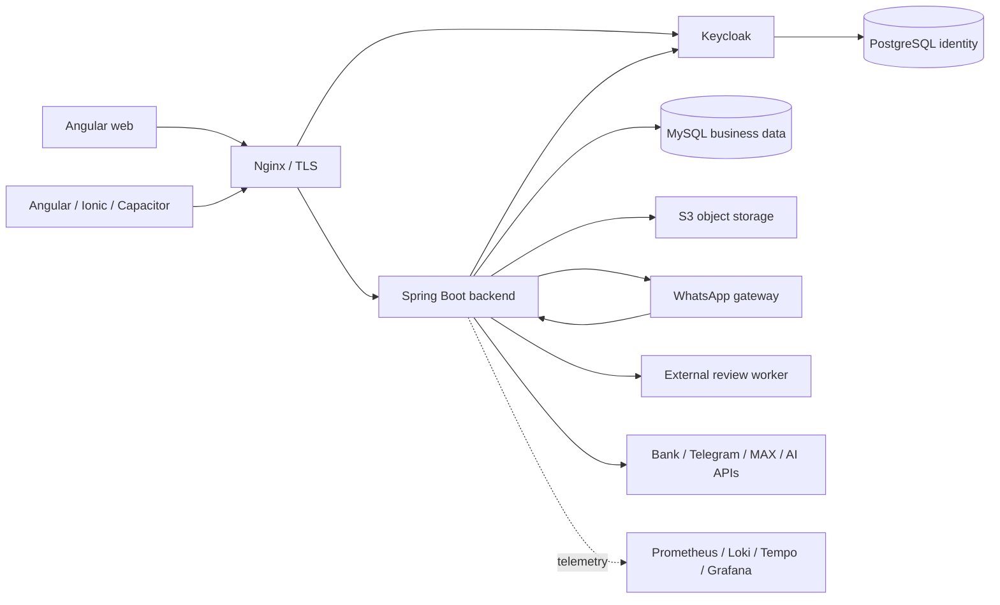

**Архитектурный аудит проекта Otziv — 8 сентября 2026 года**

**Вердикт: у проекта профессиональная инженерная основа, но архитектура еще не доведена до последовательно модульного и полностью подтвержденного эксплуатацией состояния.** Выбранная схема — Spring-монолит, отдельные браузерные интеграции, web и mobile — разумна для такой предметной области. Основной долг находится внутри границ модулей, в обработке отказов и в согласованности клиентского состояния. Объявлять весь проект соответствующим «мировым стандартам» по наличию технологий или папок нельзя. Текущий backend также не проходит собственную проверку инкапсуляции ArchUnit.

Это аудит текущего рабочего дерева, а не выпущенной версии: исходный HEAD `3458e56f29ec0288925f2a4795105fe863da5158`, на старте 712 записей `git status` — 278 измененных, 2 удаленных, 432 неотслеживаемых записи (часть представляет каталоги). Исходники приложения при аудите не исправлялись. Созданы отчет, измерения и логи; выполнены локальные сборки и тесты. Старая документация использована как описание намерений, ее выводы перепроверены по текущему коду.

**Как этот список соотносится с аудитом F01–F20 от 7 сентября.** Добавлено после сопоставления с присланным исходным отчетом. A01–A12 — смешанный список, а не перечень двадцати якобы не выполненных исправлений. «Найдено дополнительно» означает отсутствие конкретного замечания в прежнем списке; это не доказывает, что дефект появился именно вследствие исправлений.

| Категория | Сопоставление и текущий смысл |
|---|---|
| Примеры устраненных конкретных дефектов в текущем коде | F01: editor session и неизменяемый ID операции; F02: LeadCommandCodec с JavaTimeModule вместо потери payload; F05: ограничивающий Docker observer proxy; F11: permit удерживается до завершения задачи/cleanup; F12: mobile возвращает успех только для ready и действительного токена; F18: реальная readiness-проверка Chromium/OCR |
| Подтвержденное улучшение зависимостей | По npm-части F14 аудит 8 сентября дал ноль findings в четырех проверенных графах. Это не заключение обо всех production images или Maven-зависимостях |
| Прежний архитектурный долг, устраненный частично | A02 продолжает F06; A09 — F07 и остаток F19; клиентская часть A12 — F15. Архитектурные gates, application commands, facade и shared contracts появились, но не устранили все старые связи и обязанности |
| Похожие дефекты в других сценариях | A03 — входящий WhatsApp, тогда как F10 описывал исходящую доставку; A04 — ScheduledClientMessageService, тогда как F20 касался предложений performers; A07 — web refresh, тогда как F12 касался mobile; A08 — фильтры платежей, тогда как F01 касался редактора заказа/компании |
| Дополнительные конкретные находки | A05 — зависимость старта Nginx от Grafana; A06 — емкость ledger; A10 — S3 cleanup; A11 — legacy object authorization; AI-часть A12 — зависимость от конкретного провайдера |
| Новое нарушение добавленного архитектурного контроля | A01: выделен сервис уведомлений, но перенос зависимостей не согласован с policy. Требование добавить контроль выполнено; текущее изменение уже этот контроль нарушает |
| Код механизмов и эксплуатационная приемка — разные статусы | По F04/F17 инструменты восстановления PostgreSQL и независимого мониторинга уже реализованы. Фактический production restore/alert drill и выполнение целевых RPO/RTO этим аудитом не подтверждены |

Отсутствие старого F-пункта среди A01–A12 само по себе не является доказательством его закрытия. Таблица приводит проверенные примеры и смысловую связь, а не выдает новый аудит за отдельную полную приемку каждого действия прежнего remediation-плана.

**Объем и границы проверки.** Изучены структура backend, сущности и миграции, прикладные/транспортные границы, платежные и коммуникационные сценарии, безопасность, frontend/mobile, shared/contracts, оба Node-сервиса, активные Docker/Nginx-конфигурации, CI, мониторинг и восстановление. Структурная инвентаризация охватывает исходные каталоги целиком; ручной анализ сосредоточен на границах и наиболее рискованных потоках. Это не утверждение о построчной проверке каждого метода. Копии проекта в diagnostics, node_modules и сборочные артефакты не смешивались с основной кодовой базой. Production, реальные счета, провайдеры сообщений и пользовательские устройства не изменялись.

| Область | Измеренный объем | Что означает |
|---|---:|---|
| Backend production Java | 1 891 файл, 299 428 физических строк | 55 корневых пакетов; пакет не равен изолированному модулю |
| Backend test Java | 685 файлов, 156 664 строки | Включает fixtures и вспомогательные классы; не число тест-кейсов |
| Flyway SQL | 387 файлов | Управляемая эволюция схемы |
| Frontend TypeScript | 311 файлов, 83 104 строки | Включая colocated tests |
| Mobile TypeScript | 172 файла, 66 154 строки | Включая inline templates и tests |
| Shared client package | 10 TS/JS-файлов | Включая сгенерированные модели |
| Генерируемый client API | 187 операций, 204 input/output-схемы | Покрывает выбранные семейства API |

Размеры — диагностические измерения, не норматив качества и не процент покрытия тестами. Полные метрики и исходные хеши: [metrics.json](/E:/Works/Projects/otziv/.codex-tmp/architecture-audit-2026-09-08/metrics.json), [source-manifest-initial.json](/E:/Works/Projects/otziv/.codex-tmp/architecture-audit-2026-09-08/source-manifest-initial.json). [Полная инвентаризация 55 корневых пакетов](/E:/Works/Projects/otziv/.codex-tmp/architecture-audit-2026-09-08/module-inventory.md) связывает их с 26 логическими владельцами из действующей policy и показывает размер каждого пакета.

**Фактическая архитектура.** Упрощенная карта контейнеров и внешних связей:

Основные бизнес-домены — пользователи, компании, заказы/отзывы, billing/payments/ledger, исполнители, лиды, сообщения, аналитика и AI. Для заказов и платежей единая транзакционная БД позволяет сохранять атомарность. Изоляция Chromium-нагрузки в отдельных процессах и контейнерах оправданна ее ресурсами и сетевыми рисками. У монолита нет необходимости превращаться в микросервисы для исправления найденных проблем. Преждевременное разделение перенесет нынешнюю связанность в сетевые вызовы и распределенные транзакции.

Описанная Compose-топология рассчитана преимущественно на один Docker-host. Это допустимый выбор при согласованных требованиях к простою и восстановлению. Репозиторий сам по себе не подтверждает высокую доступность или фактическую production-топологию.

**Сопоставление с международными подходами.** Использованы публичные первичные описания стандартов как критерии оценки, без заявления о формальном прохождении всех пунктов:

| Основа | Что она дает для оценки | Результат для проекта |
|---|---|---|
| [ISO/IEC 25010:2023](https://www.iso.org/standard/78176.html) | Модель измеряемых свойств качества продукта | Есть тестируемость, защита и механизмы надежности; сопровождаемость ограничена связанностью, capacity/SLO production не установлены |
| [ISO/IEC/IEEE 42010:2022](https://www.iso.org/standard/74393.html) | Требования к описанию архитектуры, а не предписание конкретной архитектуры | ADR и карта владельцев полезны; нужны согласованные требования, эксплуатационные подтверждения и актуальная общая карта системы |
| [OWASP ASVS](https://owasp.org/www-project-application-security-verification-standard/) | Проверяемые требования безопасности web-приложений | Реализовано много существенных контролей; полного ASVS assessment не проводилось, условный дефект object authorization найден |
| [OWASP MASVS](https://mas.owasp.org/MASVS/) | Требования безопасности мобильных приложений | SecureStorage и native barriers присутствуют; проверка APK/IPA, устройства и полного жизненного цикла сессии в этот аудит не входила |
| [NIST SSDF, SP 800-218](https://csrc.nist.gov/pubs/sp/800/218/final) | Практики безопасной разработки на протяжении жизненного цикла | Сильные CI/security/recovery механизмы; фактическое исполнение required checks и приемка конкретного релиза требуют отдельного подтверждения |

Единой обязательной «правильной архитектуры» для всех продуктов эти документы не задают. Поэтому оценка основана на обеспечиваемых свойствах, а не на наличии Kubernetes, DDD, Clean Architecture или микросервисов.

**Что выполнено профессионально.**

- Архитектурные ограничения исполняются по bytecode: [ModuleEncapsulationTest](/E:/Works/Projects/otziv/backend/src/test/java/com/hunt/otziv/architecture/ModuleEncapsulationTest.java:43) проверяет чужие internals и циклические ребра, запрещает новые нарушения и устаревшие разрешения. Обнаруженное падение подтверждает практическую работу gate.
- У production persistence включены Flyway и `ddl-auto=validate`, выключен Open Session in View: [application-prod.properties](/E:/Works/Projects/otziv/backend/src/main/resources/application-prod.properties:79). У ядра есть `@Version`, точечные pessimistic locks и guard-сервисы конкурентных изменений.
- Финансовые сценарии имеют специализированные transaction boundaries, повторную проверку банковских наблюдений, стабильные operation IDs и durable delivery. Например, [PaymentSuccessNotificationDeliveryService](/E:/Works/Projects/otziv/backend/src/main/java/com/hunt/otziv/payments/service/PaymentSuccessNotificationDeliveryService.java:74) использует claim, отправку и финализацию отдельно. Нельзя описывать все платежные уведомления как ненадежный best-effort.
- API использует default deny, method security, Keycloak и проверку локального состояния сессии: [SecurityConfig](/E:/Works/Projects/otziv/backend/src/main/java/com/hunt/otziv/u_users/config/SecurityConfig.java:108). Credentials защищены AES-GCM, выдача чувствительных значений аудируется.
- Собственное расширение Keycloak хранит security generation отдельно от профиля, соблюдает порядок locks realm → user и помечает транзакцию rollback-only при невозможности записать изменение: [GenerationStore](/E:/Works/Projects/otziv/infrastructure/keycloak/security-generation/src/main/java/com/hunt/otziv/issuer/GenerationStore.java:23), [GenerationEvents](/E:/Works/Projects/otziv/infrastructure/keycloak/security-generation/src/main/java/com/hunt/otziv/issuer/GenerationEvents.java:40). Этот участок проверен статически и чтением тестов; его отдельный контейнерный protocol proof в данном аудите не повторялся.
- Worker имеет проверку адресов, DNS pinning, ограничение очереди и Chromium sandbox; браузерные сервисы отделены от БД сетями. Docker socket вынесен за ограничивающий API proxy. Это реальные меры, а не только декларации Dockerfile.
- Оба клиента используют strict TypeScript/templates, lazy routes, feature APIs, локальные facade и проверки жизненного цикла редакторов. Общий пакет валидирует Java-derived contracts, неизвестные статусы платежей не разрешают действие автоматически.
- CI включает unit/runtime/browser/MySQL/architecture/native проверки, аудит зависимостей, фиксированные image digests, миграционные и recovery guards. Реализованы инструменты backup/restore обеих БД, object storage и независимого мониторинга. Наличие этих инструментов не заменяет испытание production-восстановления.

**Подтвержденные замечания.** P1 здесь означает первоочередную проблему доставки/доступа или блокирующий результат проверки; P2 — значимый дефект надежности или сопровождаемости. Приоритет не является CVSS. Для условных сценариев явно указаны условия.

**A01 · P1 · Текущее дерево нарушает собственный архитектурный gate.** В запуске `mvnw verify` падает `ModuleEncapsulationTest.foreignInternalsAndNewModuleCyclesCannotBypassPublicApis`: [WorkerRiskExplanationNotificationService.java:3](/E:/Works/Projects/otziv/backend/src/main/java/com/hunt/otziv/worker_activity/service/WorkerRiskExplanationNotificationService.java:3) обращается к пяти неразрешенным внутренним типам — `User`, `UserService`, `TelegramService`, `Manager`, `PersonalReminderService`. Новый файл есть в исходниках и скомпилирован этим запуском; это не оставшийся старый bytecode. Уведомления извлечены из WorkerRiskTelegramCallbackService без согласования архитектурного контракта. Свежий observed содержит 3 015 связей против 3 011 в baseline: пять добавленных и одну исчезнувшую; устаревшее разрешение CallbackService → Manager тоже осталось в baseline. Источник проверки: [ModuleEncapsulationTest.java:58](/E:/Works/Projects/otziv/backend/src/test/java/com/hunt/otziv/architecture/ModuleEncapsulationTest.java:58); [лог текущего запуска](/E:/Works/Projects/otziv/.codex-tmp/architecture-audit-2026-09-08/backend-verify-after-bootstrap.log). Это нельзя считать готовым к слиянию состоянием при действующих правилах проекта. Исправление: использовать согласованные API либо явно обосновать перенос прежних исключений согласно политике проекта и удалить устаревшее разрешение. Простое автоматическое расширение baseline скрывает нарушение и не улучшает архитектуру.

**A02 · P2 · Большой накопленный долг между модулями.** В текущих baseline зафиксированы **3 011 class→class обращений к чужим internals, 306 связей с чужими repositories и 207 циклических ребер между логическими модулями**. Это пересекающиеся множества, их нельзя складывать; 207 — не число отдельных циклов. Конкретный пример: [CompanyServiceImpl](/E:/Works/Projects/otziv/backend/src/main/java/com/hunt/otziv/c_companies/service/CompanyServiceImpl.java:97) зависит от ReviewService, а [ReviewServiceImpl](/E:/Works/Projects/otziv/backend/src/main/java/com/hunt/otziv/r_review/service/ReviewServiceImpl.java:87) — от FilialService; компании напрямую читают NextOrderRequestRepository. Следствие — изменение одного домена затрагивает чужие внутренние модели и проверки. Исправление: выносить команды и read projections в API владельца данных, сокращая baseline при каждой миграции. Это постепенная декомпозиция монолита.

Свежий bytecode-анализ этого запуска дополнительно подтвердил: 3 015 фактических internals-связей, 306 repository-связей и 207 циклических ребер из 222 направленных межмодульных ребер. Это граф логических владельцев из policy, а не Spring bean cycles и не граф сетевых микросервисов. Копии результатов: [internals](/E:/Works/Projects/otziv/.codex-tmp/architecture-audit-2026-09-08/cross-module-internals-observed.txt), [repositories](/E:/Works/Projects/otziv/.codex-tmp/architecture-audit-2026-09-08/cross-module-persistence-observed.txt), [граф](/E:/Works/Projects/otziv/.codex-tmp/architecture-audit-2026-09-08/module-graph-observed.txt), [циклические ребра](/E:/Works/Projects/otziv/.codex-tmp/architecture-audit-2026-09-08/module-cycles-observed.txt).

**A03 · P1 · Входящее WhatsApp-сообщение может потеряться для backend.** [index.js:534](/E:/Works/Projects/otziv/whatsapp/index.js:534) после ошибки обработчика только логирует сбой; [postSignedWebhook](/E:/Works/Projects/otziv/whatsapp/index.js:666) прекращает попытки по лимиту. [message-webhook.js:457](/E:/Works/Projects/otziv/whatsapp/message-webhook.js:457) сохраняет ACK после успеха, но не durable pending payload до отправки. Если backend недоступен дольше retry window либо gateway перезапущен, первое сообщение может не попасть в контроль неотвеченных. [Reconciliation](/E:/Works/Projects/otziv/backend/src/main/java/com/hunt/otziv/client_chat_control/service/ClientChatMessageReconciliationService.java:42) начинает с уже OPEN элементов и не закрывает этот сценарий; выборка истории ограничена 100 сообщениями. Исправление: persistent inbox перед send, стабильный ID, фоновые retries/dead-letter, восстановление по cursors с пагинацией. Исходящая keyed-доставка уже защищена ledger — этот вывод относится к входящему направлению.

**A04 · P2 · Открытые транзакции и row locks переживают сетевую отправку.** [ScheduledClientMessageService.java:288](/E:/Works/Projects/otziv/backend/src/main/java/com/hunt/otziv/client_messages/service/ScheduledClientMessageService.java:288) запускает обычные сценарии через REQUIRES_NEW, [строка 1766](/E:/Works/Projects/otziv/backend/src/main/java/com/hunt/otziv/client_messages/service/ScheduledClientMessageService.java:1766) получает `findByIdForUpdate`, [строка 2605](/E:/Works/Projects/otziv/backend/src/main/java/com/hunt/otziv/client_messages/service/ScheduledClientMessageService.java:2605) отправляет сообщение. NOT_SUPPORTED для части транспорта приостанавливает внешнюю транзакцию, но не освобождает ее соединение/блокировки. Медленный провайдер увеличивает время удержания locks и давление на пул. Идемпотентность/карантин уже есть; произвольные дубли этим замечанием не утверждаются. Исправление: распространить существующую для BAD_REVIEW_INVOICE схему `prepare → commit → send → finalize` на другие сценарии.

**A05 · P2 · Запуск сайта зависит от вспомогательного мониторинга.** [docker-compose.yaml:833](/E:/Works/Projects/otziv/docker-compose.yaml:833) требует healthy Grafana для Nginx; [строка 1015](/E:/Works/Projects/otziv/docker-compose.yaml:1015) связывает старт Grafana с Prometheus/Loki/Tempo. При восстановлении или пересоздании ingress неисправность мониторинга блокирует публичный сайт даже при готовых app/Keycloak. Уже запущенный Nginx не останавливается просто от падения Grafana. Исправление: убрать monitoring из обязательной цепочки startup ingress; временная ошибка маршрута Grafana должна ограничиваться этим маршрутом.

**A06 · P2 · WhatsApp ledger имеет предел емкости, не отраженный в readiness.** [operation-ledger.js:47](/E:/Works/Projects/otziv/whatsapp/operation-ledger.js:47) задает 100 000 записей по умолчанию; [строка 113](/E:/Works/Projects/otziv/whatsapp/operation-ledger.js:113) синхронно сканирует каталог на каждую новую операцию и отклоняет новую работу при full. Терминальные записи намеренно не удаляются ради защиты от повторов. При этом `/ready` проверяет `healthy`, который при full не меняется: [index.js:952](/E:/Works/Projects/otziv/whatsapp/index.js:952). Время до заполнения зависит от трафика и не измерялось. Исправление: occupancy/remaining/alert, корректный admission status, индексированное хранилище и архивная стратегия с сохранением защиты на весь период повторных запросов. Простое TTL-удаление опасно для существующей идемпотентности.

**A07 · P2 · Временная ошибка refresh принудительно завершает web-сессию.** [auth.service.ts:146](/E:/Works/Projects/otziv/frontend/src/app/core/auth.service.ts:146) передает любую ошибку updateToken в [handleRefreshFailure:266](/E:/Works/Projects/otziv/frontend/src/app/core/auth.service.ts:266), затем очищает состояние и вызывает Keycloak logout. Изолированное воспроизведение текущего AuthService с еще действительным access token и сетевой ошибкой `status=0` дало `authenticated=false`, `status=expired`, один logout: [лог](/E:/Works/Projects/otziv/.codex-tmp/architecture-audit-2026-09-08/frontend-auth-offline-repro.log). В mobile временная недоступность уже различается. Исправление: отделить недействительную/отозванную сессию от offline/5xx, сохранить recoverable refresh state, применять ограниченные повторы. Это не основание принимать истекшие или отозванные токены.

**A08 · P2 · Журнал платежей может показывать результаты другого фильтра.** Mobile меняет поиск, но [loadPaymentLinks:3446](/E:/Works/Projects/otziv/mobile/src/app/features/tbank.page.ts:3446) игнорирует новую загрузку во время предыдущей. Web [loadPaymentLinks:2010](/E:/Works/Projects/otziv/frontend/src/app/features/admin/tbank-payments/tbank-payments.component.ts:2010) допускает применение старого ответа после нового. Детерминированная проверка извлеченных реальных методов: mobile показывает поиск `ab`, но запросил и применил только `a`; web показывает фильтр `failed`, но после перестановки ответов применяет `paid`: [лог](/E:/Works/Projects/otziv/.codex-tmp/architecture-audit-2026-09-08/payment-filter-race-repro.log). Это ошибочная выдача журнала, а не доказанное изменение состояния банковского платежа. Исправление: единый query-state, отмена/epoch для старых GET, обязательное выполнение последнего запроса. Для writes автоматический replay не добавлять.

**A09 · P2 · Часть классов объединяет слишком много обязанностей.** [ApiWorkerBoardController](/E:/Works/Projects/otziv/backend/src/main/java/com/hunt/otziv/p_products/controller/ApiWorkerBoardController.java:137) содержит около 28 внедряемых зависимостей и 2 506 строк: HTTP, доступ, метрики, ORM-данные и DTO. Web [OrderDetailsComponent](/E:/Works/Projects/otziv/frontend/src/app/features/manager/order-details.component.ts:120) имеет 3 812 строк тела класса и 274 метода, ManagerControl — 2 980/246. У mobile Manager — 2 275 строк тела и 175 методов. Клиентские измерения исключают inline HTML/styles из декоратора; [метрики классов](/E:/Works/Projects/otziv/.codex-tmp/architecture-audit-2026-09-08/client-class-metrics.log). Размер сам по себе не ошибка, но здесь он сочетается с несколькими независимыми причинами изменения. Исправление: query services/DTO assemblers для backend и локальные фасады состояния по сценарию для UI. Выделение классов только ради лимита строк не является целью.

**A10 · P2 · Очистка S3 имеет окно потери задания.** [ApiManagerReviewController.java:318](/E:/Works/Projects/otziv/backend/src/main/java/com/hunt/otziv/manager/controller/ApiManagerReviewController.java:318) читает старый URL, загружает новый объект, сохраняет ссылку, затем отдельно удаляет старый. [S3UploadServiceImpl.java:110](/E:/Works/Projects/otziv/backend/src/main/java/com/hunt/otziv/s3/service/S3UploadServiceImpl.java:110) записывает persistent cleanup после ошибки delete. Падение процесса между commit замены URL и первым delete/enqueue оставляет объект без задания; два параллельных upload могут прочитать один старый URL. Следствие — orphan-объекты и рост хранения, не доказанная потеря актуального фото. Исправление: фиксировать intent очистки вместе с заменой URL под общей блокировкой; для новых upload — staging/registry и сверка незавершенных загрузок.

**A11 · P1 при включении legacy · Обход проверки принадлежности загружаемого фото.** [ReviewFileController.java:25](/E:/Works/Projects/otziv/backend/src/main/java/com/hunt/otziv/s3/controller/ReviewFileController.java:25) принимает review ID и меняет объект через repository без actor/scope guard. При legacy=true [SecurityConfig.java:318](/E:/Works/Projects/otziv/backend/src/main/java/com/hunt/otziv/u_users/config/SecurityConfig.java:318) допускает роли включая WORKER/MANAGER, а Nginx проксирует `/legacy/reviews/...`. Авторизованный пользователь способен подставить чужой ID; наличие CSRF не заменяет object authorization. По текущим production defaults legacy=false, поэтому это **не утверждение об открытой уязвимости штатной конфигурации**. До включения режима нужно убрать endpoint или провести его через application service с проверкой actor/принадлежности и отрицательным тестом чужого review.

**A12 · P2/P3 · Независимость application и общие API-модели реализованы не везде.** AI [AiSingleReviewDraftFactory.java:388](/E:/Works/Projects/otziv/backend/src/main/java/com/hunt/otziv/reputationai/application/service/AiSingleReviewDraftFactory.java:388) зависит от конкретного infrastructure OpenAiProvider. Это допустимо для обычной слоистой архитектуры, но не подтверждает Clean/Hexagonal core. В клиентах часть DTO вручную повторяется; mobile feature APIs импортируют типы из большого compatibility ApiService, а scope генератора покрывает выбранные семейства API. Исправление: вводить нейтральный AI-порт, если сменяемость провайдера является требованием; использовать generated input/output в transport-адаптерах и отдельные view models. Runtime-валидацию сохранить. Здесь установлен риск сопровождаемости, а не конкретный расчетный дефект.

**Проверки и ограничения доказательства.** Все команды выполнялись локально. Production web-build mobile не является сборкой APK/IPA. Source/contract tests, unit/runtime tests и browser scenarios указаны отдельно, поскольку это разные уровни проверки.

| Проверка | Результат текущего аудита |
|---|---|
| Backend build-support, JDK 26 / Maven 3.9.15 | Подготовительный reactor успешно собран и установлен локально |
| Backend `mvnw -B -ntp verify` | **FAIL**: 4 722 теста, 4 706 прошли, 1 failure, 0 errors, 15 skipped; 26 мин 33 с |
| Backend architecture gates | 11 проверок прошли, 1 упала: ModuleEncapsulationTest |
| Frontend unit | 697 тестов, 104 файла — PASS |
| Mobile runtime | 175 тестов, 21 файл — PASS |
| Mobile Node/source contracts | 229 тестов — PASS |
| Shared contracts | 26 тестов — PASS |
| Генерация контрактов `--check` | PASS, 187 операций / 204 схемы |
| WhatsApp gateway | 103 теста — PASS |
| External review worker | 32 теста — PASS |
| Playwright browser smoke | 22 сценария — PASS, loopback fixtures, внешние запросы блокируются |
| Recovery/monitoring/runtime-security unit fixtures | 215 тестов — PASS |
| Repository/performance-policy fixtures | 18 тестов — PASS |
| Python build-support policy | 27 тестов — PASS |
| Infrastructure contract / monitoring Compose | PASS; monitoring validation не запускала сервисы |
| Frontend и mobile production web builds | PASS; initial 558,90 kB и 993,19 kB raw, соответственно |
| `npm audit --json` в четырех npm-приложениях | 0 зарегистрированных уязвимостей для проверенных графов на момент запуска |
| Android 73 contract compatibility | PASS с явными ограничениями: minimumVerified=false, supportWindowReady=false, nativeUpgradeProven=false |

Логи находятся в [каталоге аудита](/E:/Works/Projects/otziv/.codex-tmp/architecture-audit-2026-09-08), сводка — в [verification-summary.json](/E:/Works/Projects/otziv/.codex-tmp/architecture-audit-2026-09-08/verification-summary.json). Backend скомпилировал production и test Java, выполнил полный обычный набор и остановился на test-фазе из-за A01; успешная упаковка нового JAR этим запуском не подтверждается. Первая попытка backend остановилась на неустановленном локальном `docker-java-transport-zerodep`; после предусмотренного build-support bootstrap выполнен повтор. Первая инфраструктурная проверка имела один failure из-за отсутствия openssl в PATH; после подключения уже установленного OpenSSL все 215 тестов прошли. Эти две ошибки окружения не классифицированы как дефекты приложения.

Изолированные воспроизведения A07/A08 сохранены отдельно: [frontend-auth-offline-repro.mjs](/E:/Works/Projects/otziv/.codex-tmp/architecture-audit-2026-09-08/frontend-auth-offline-repro.mjs), [payment-filter-race-repro.mjs](/E:/Works/Projects/otziv/.codex-tmp/architecture-audit-2026-09-08/payment-filter-race-repro.mjs). Их запуск через `node` из корня проекта подтверждает наличие описанного дефекта; это не новые исправляющие тесты в кодовой базе и не интеграция с реальным Keycloak/банком.

Полный свежий аудит Maven-зависимостей с внешними vulnerability analyzers и сканирование каждого production image здесь не выполнялись. Нулевой результат npm audit не доказывает безопасность Java, OS-пакетов, собственного кода или deployment. Не выполнялись signed native upgrade, сборка iOS, проверка реального устройства, внешний pentest и полное восстановление production. Проценты code coverage и production p95/p99 не измерялись; наличие большого числа тестов не позволяет их выдумывать.

Пропуски backend учитываются отдельно: `ContractorPaymentProdLikeUpgradeRehearsalTest` требует явно включаемой репетиции на подготовленной disposable копии схемы; 13 тестов `ReputationSingleReviewDraftServiceTest` помечены `@Disabled` из-за отключенного локального AI-fallback; `KeycloakSessionProtocolRuntimeIntegrationTest` требует отдельного issuer runtime. Они не считаются прошедшими. Запуск основного Spring-приложения и monitoring Spring-контекста с реальной MySQL прошел; все 387 Flyway-миграций применились к каждой из этих новых тестовых БД.

**Что еще требуется подтвердить для эксплуатационной приемки.** В [monitoring README](/E:/Works/Projects/otziv/infrastructure/monitoring/README.md:3) прямо не выбраны реальные provider/contact/schedule/SLO/RPO. Это не доказательство отсутствия мониторинга на сервере: параметры могут корректно находиться вне Git. Аналогично backup defaults и fixtures не устанавливают фактическую сохранность копий. Нужны согласованные владельцы и измеренные целевые/фактические SLO, RPO, RTO; независимое хранение; восстановление MySQL + Keycloak/PostgreSQL + objects + keys + integration state; доставка оповещения при потере host. Для mobile нужно определить реально поддерживаемый минимум релизов и проверить signed upgrade/refresh/push/rollback. Required-check policy GitHub необходимо подтвердить на самом репозитории, одного YAML недостаточно.

**Порядок улучшений.**

| Очередь | Работа | Критерий завершения |
|---|---|---|
| Первоочередная | A01, A03; A11 до любого включения legacy | Архитектурный gate зеленый; входящий payload переживает outage/restart; чужой review недоступен во всех включенных transports |
| Следующая | A05, A06, A07, A08 | Сайт стартует без monitoring; заполнение ledger наблюдается заранее; offline не отзывает сессию; старые GET не меняют актуальную выдачу |
| Затем | A04, A10 | Нет удержания transaction/locks на provider I/O; задания cleanup переживают crash и параллельные изменения |
| Последовательно по доменам | A02, A09, A12 | Сокращаются фактические межмодульные обходы; команды/queries имеют владельца; UI и transport не дублируют правила |
| Перед эксплуатационным заключением | Реальная release/DR/alert/capacity приемка | Сохранены воспроизводимые доказательства конкретного релиза и согласованных требований |

Полная переработка системы для достижения этих целей не требуется. Рациональный путь — сохранить выбранную топологию, закрыть подтвержденные дефекты и завершать модульные границы по бизнес-сценариям. Возможность работать с текущей нагрузкой и соответствие требованиям высокой доступности нужно оценивать отдельно, по измерениям и допустимому для бизнеса простою.
