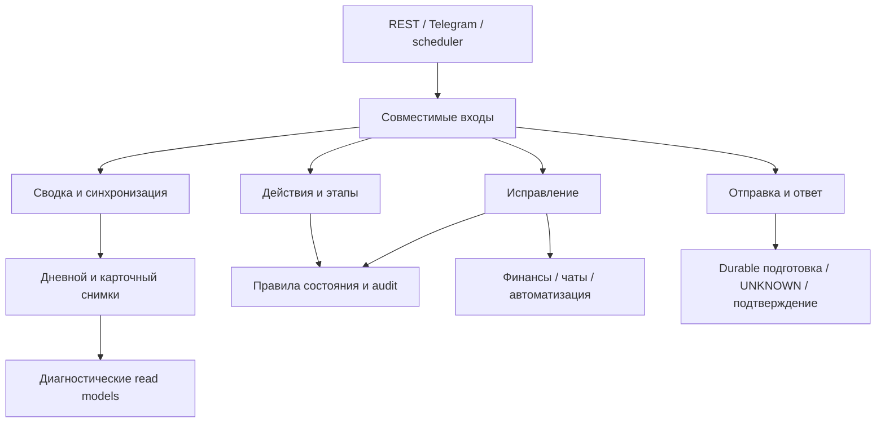

# Границы сценариев контроля менеджера

Дата: 2026-09-07. Реализация P18. `ManagerControlService` сохраняет совместимые
входы для REST, Telegram и schedulers. Правила выполняют перечисленные ниже
сервисы; обратные зависимости на совместимый фасад запрещены ArchUnit.

| Владелец | Ответственность и граница |
|---|---|
| `ManagerControlBoardWorkflow` | Сводка, детали менеджера и явная синхронизация; прежние public `Transactional` перенесены вместе с операцией |
| `ManagerControlProblemExamples` | Диагностические примеры из существующих read models; прежние фильтры, лимиты и SQL-вызовы |
| `ManagerControlDailySnapshotWorkflow` | Формирование и сохранение дневного снимка, качество и агрегаты; работает в транзакции вызывающего сценария |
| `ManagerControlConcreteSnapshotWorkflow` | Сопоставление актуальных и сохранённых карточек, повторное открытие и закрытие устаревших; это изменяющая состояние операция |
| `ManagerControlDayLifecycle` | Блокеры, окна этапов, принятие, закрытие и повторное открытие дня |
| `ManagerControlDayActions` | Авторизованные команды этапа/закрытия/принятия с прежней REQUIRED-транзакцией |
| `ManagerControlItemActions` | Действия над пунктом и карточкой: разрешения, состояние, follow-up, audit и gamification |
| `ManagerControlWorkerTaskWorkflow` | Запрос объяснения/действия исполнителя, состояние напоминания и существующий канал уведомления |
| `ManagerControlReminderWorkflow` | Просроченные этапы и уведомления об отложенной карточке; единственный `Scheduled` остаётся на фасаде, транзакция принадлежит workflow |
| `ManagerControlRepairWorkflow` | Проверка доступа и выбор законченного сценария исправления |
| `ManagerControlChatRepairWorkflow` | Проверка/восстановление привязки чата через существующие адаптеры |
| `ManagerControlAutomationRepairWorkflow` | Перепроверка источника ошибки, evidence для неопределённой отправки и разрешённое восстановление очереди |
| `ManagerControlRepairOutcome` | Сохранение результата исправления, состояния контроля и audit в исходной транзакции |
| `ManagerControlClientSendWorkflow` | Подготовка → внешняя отправка → условная фиксация результата; token/source fencing и UNKNOWN |
| `ManagerControlClientReplyWorkflow` | Durable ответ, V301 ledger, блокировка дубля между карточками/перезапусками, сверка доказанной доставки |
| `ManagerControlClientConversationWorkflow` | Подсказка ответа, классификация и сверка диалога с повторной проверкой прав |

Общие проверки доступа, оформление карточки, SLA и формирование текста остаются
отдельными существующими владельцами. Финансовое исправление использует
`ManagerControlInvoiceRepairWorkflow` с NOT_SUPPORTED: оно приостанавливает
транзакцию контроля, а результат карточки сохраняется после возврата в неё.

Извлечение сохраняет тела правил, количество вызовов репозиториев, propagation
и порядок внешних эффектов. В частности, историческое чтение сохранённых карточек
может закрывать устаревшие записи; оно не превращено в чистый read-only запрос.
Старые уведомления о просрочке не получили новую гарантию durable delivery от
одного переноса в workflow. Их прежняя транзакционная семантика сохранена.

Проверка AST относительно среза перед извлечением: 215 тел правил эквивалентны,
101 делегат, изменённых тел и дублированных реализаций нет. Единственная намеренная
дельта аннотаций: scheduler вызывает отдельный транзакционный bean.
202 недостижимых private-делегата удалены; public API и private-входы существующих
reflection-тестов сохранены. Десять старых разрешений на чужие репозитории для
`ManagerControlService` удалены из baseline после bytecode-проверки.

Регрессии используют реальные новые collaborators. Полный Spring startup с
MySQL и V301 проверяется отдельно от JDBC-адаптеров transaction/concurrency tests.
Актуальные результаты общего среза находятся в
[статусе реализации](ARCHITECTURE_IMPLEMENTATION_STATUS_2026-09-07.md), а протокол
ответов и условия включения — в
[MANAGER_CONTROL_DELIVERY_ROLLOUT.md](MANAGER_CONTROL_DELIVERY_ROLLOUT.md).
